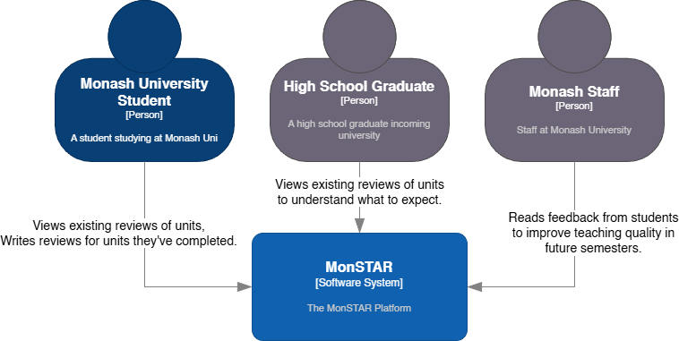
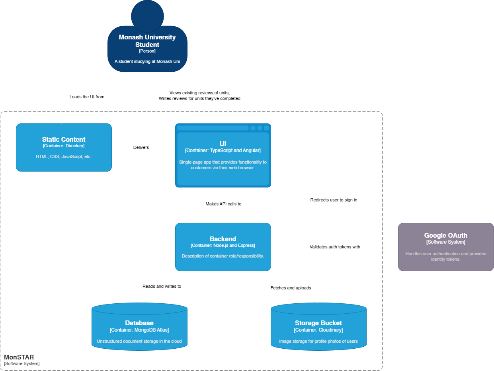

  

<h4 align="center">
  A digital platform built for students at Monash University. Real unit reviews from students, provided with historical SETU data.
</h4>

<h3 align="center">
  <a href="https://monstar.wired.org.au">🌍 Website</a>
   · 
  <a href="./CONTRIBUTING.md">🤝 Contributing</a>
   · 
  <a href="https://github.com/wired-projects/monstar/issues">🚩 Issues</a>
   · 
  <a href="https://monstar.wired.org.au/changelog">📋 Changelog</a>
</h3>

 

## What is MonSTAR?

MonSTAR helps Monash University students make informed decisions about their unit selections. The platform aggregates student reviews and SETU (Student Evaluation of Teaching and Units) data from 2019 onwards, providing both qualitative experiences and quantitative metrics for thousands of units.

Students can browse units, read peer reviews, compare SETU scores across semesters, and contribute their own experiences after completing units.

## Features

MonSTAR provides several features for exploring and reviewing Monash subjects:

- **Unit Search** - Search by unitcode or the name, additional filtering by teaching period, faculty, etc
- **Student Reviews** - Read and write reviews with ratings across enjoyment, simplicity, usefulness
- **AI Sentiment Overviews** - Gemini AI overviews for units, reviewing existing student review sentiment
- **SETU Data** - Historical SETU results from sem 1 2019 up to most recent (authentication required)
- **Unit Pathways Map** - Interactive graph showing unit pathways, prerequistes and future requirements
- **Google Authentication** - Monash student/staff verification through email verification
- **Review Interactions** - Like/dislike reviews with notifications
- **Unit Tags** - Dynamically assigned tags like "WAM Booster"

## Architecture
### System context

### Container diagram

## Contributing

MonSTAR was built by Monash students. Contributions are welcome from the community.

Before starting work on a feature, please read the [Contributing Guide](./CONTRIBUTING.md) for:
- Development environment setup
- Code style and conventions
- Pull request process
- Testing requirements

You can contribute by:
- Reporting bugs or suggesting features via [GitHub Issues](https://github.com/wired-projects/monstar/issues)
- Fixing existing issues
- Improving documentation
- Adding new features (after discussing in an issue first)

## Data Sources

MonSTAR's unit catalog and SETU data are sourced using tools developed by **Sai Kumar Murali Krishnan**:
- [monash-handbook-scraper](https://github.com/saikumarmk/monash-handbook-scraper) - Unit metadata extraction
- [unit-outcome-miner](https://github.com/saikumarmk/unit-outcome-miner) - SETU survey data aggregation

## Contact

**Developed by:** WIRED Projects Team, Monash University \
**Primary person of contact:** Email jenul15ferdinand@gmail.com or add me on discord at proxy_dev\
**Issues:** [GitHub Issues](https://github.com/wired-projects/monstar/issues)

## License

This project is licensed under the AGPL 3.0 License - see the [LICENSE](LICENSE) file for details.
